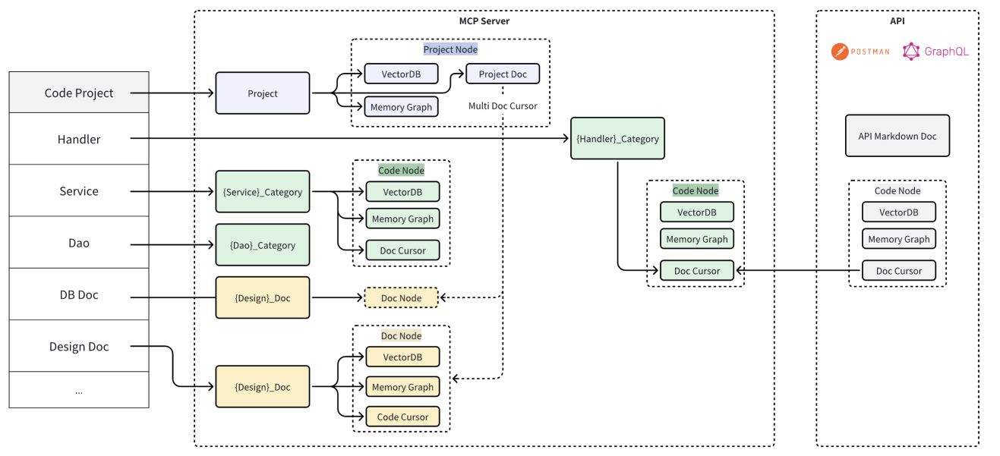

# McpCodeWhisper

An intelligent code-doc-code automation system that enables natural language code debugging and automatic bug fixing through large language models.

## System Architecture



### Architecture Components

1. **Input Layer**
   - Code Project: Source code and project files
   - Handler: Request handlers and controllers
   - Service: Business logic services
   - Dao: Data access objects
   - DB Doc: Database documentation
   - Design Doc: System design documentation

2. **MCP Server**
   - **Project Node**
     - VectorDB: Vector storage for project data
     - Memory Graph: In-memory relationship graph
     - Project Doc: Project documentation
     - Multi Doc Cursor: Document navigation tool
   
   - **Code Node**
     - VectorDB: Code vector storage
     - Memory Graph: Code relationship graph
     - Doc Cursor: Document navigation

   - **Category System**
     - {Service}_Category: Service categorization
     - {Handler}_Category: Handler categorization
     - {Dao}_Category: DAO categorization

   - **Doc Node**
     - VectorDB: Document vector storage
     - Memory Graph: Document relationship graph
     - Code Cursor: Code navigation tool

3. **API Layer**
   - Postman Integration
   - GraphQL API
   - API Markdown Documentation
   - Code Node API interface

### Key Features

- Automatic code-to-documentation conversion
- Documentation-to-code generation
- Natural language code debugging
- Memory graph for relationship management
- Vector database for efficient similarity search
- Multi-cursor document navigation
- Unified API interface

## Getting Started

```bash
# Install dependencies
npm install

# Start the server
npm start
```

## Project Structure

```
src/
├── core/          # Core functionality
│   ├── vector/    # Vector database integration
│   ├── graph/     # Memory graph implementation
│   └── cursor/    # Document cursor logic
├── server/        # MCP Server implementation
│   ├── project/   # Project node
│   ├── code/      # Code node
│   └── doc/       # Doc node
└── api/           # API endpoints and documentation
```

## Contributing

Please read our contributing guidelines before submitting pull requests.

## License

[MIT License](LICENSE)
